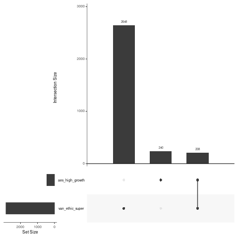

# Comparing super fund holdings

Upset plot visualisation of the intersection in holdings between Vanguard Ethically Conscious Super Fund and Australian Ethical Super High Growth Fund.

See  for a better res fig. Github doesn't render pdf and png exports using R graphics of upset plots seemingly has an unchangeable res.

## Incoming/TODO

* General clean of analysis
* Explore stats test beyond the upset plot e.g. chi-squared
* Add more funds (?)
